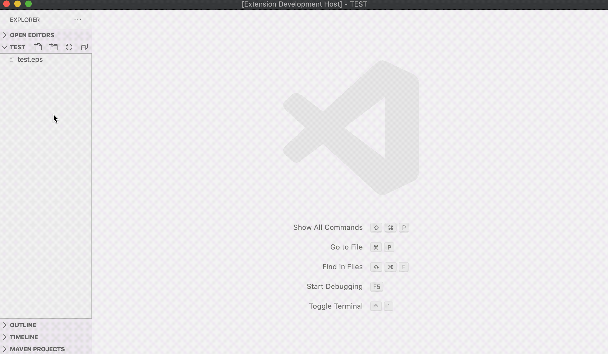

# eps-preview: Preview EPS figure files in VSCode

## Features

This extension enables the in-VSCode preview of EPS image files.
A new command `eps-preview.sidePreview` is added as well as a preview icon in the menu bar when EPS files is open in VSCode.

A short demo is here:



## Requirements

This extension depends on the `PostScript Language` extension to recognize EPS file.
You can install that extension from the VSCode extension store.

This extension also depends on two commands -- `ps2pdf` and `pdf2svg` to generate the preview.
Thus you need to install these two commands first and ensure they are in the executable path.
For MacOS, you could install them via homebrew:

```sh
brew install ghostscript pdf2svg
```

## Extension Settings

Currently, no extension setting is available. Do we need one?

## Known Issues

Not yet.

## Release Notes

Users appreciate release notes as you update your extension.

### 0.0.1

Initial release (if it counts).

**Enjoy!**
