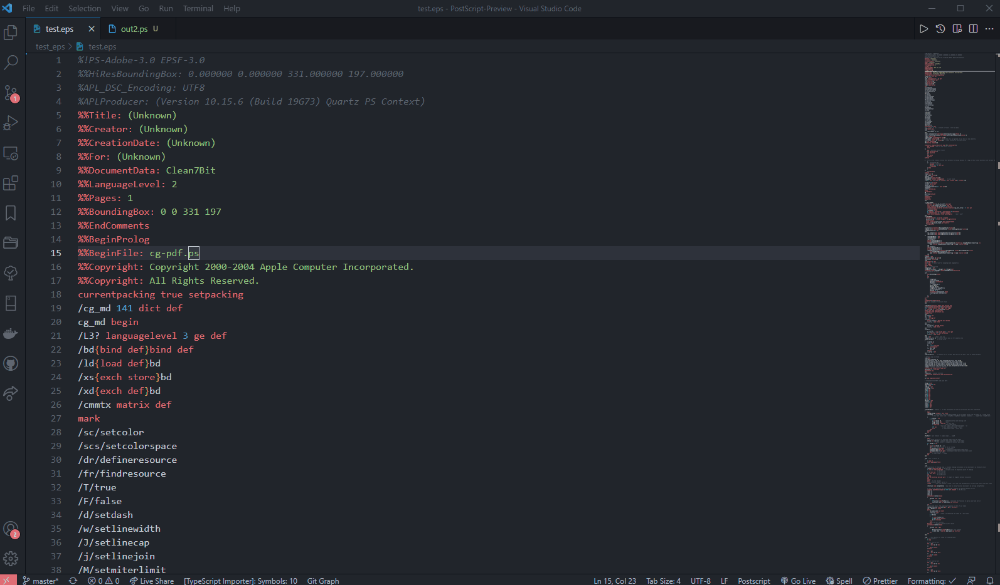

# PostScript-Preview: Preview EPS and PS files in VSCode


## Features

This extension enables the in-VSCode preview of EPS image files.
A new command `postscript-preview.sidePreview` is added as well as a preview icon in the menu bar when EPS or PS files are open in VSCode.




## Requirements

This extension depends on the `PostScript Language` extension to recognize EPS/PS file.
You can install that extension from the VSCode extension store.

This extension also depends on two commands:

- `ps2pdf` - to first convert the EPS/PS file to PDF (the command is part of GhostScript)
- `pdf2svg` - to convert the generated pdf to svg which is shown in the preview

Thus you need to install these two commands first and ensure they are in the executable path.

For **macOS/Linux**, you could install them via homebrew:

```sh
brew install ghostscript pdf2svg
```


For **Windows 10**, you need to have [GhostScript](https://www.ghostscript.com/download/gsdnld.html) installed in your system.  You can install  them via [Chocolatey](https://chocolatey.org/install). Then run the following commands using an administrative shell.

```bash
choco install ghostscript

choco install pdf2svg --ignore-checksums

refreshenv

set PATH=%PATH%;C:\ProgramData\chocolatey\lib\pdf2svg\tools\pdf2svg-windows-master\dist-64bits
```


You should now be able to view the EPS/PS files in the preview.


## Known Issues

None yet. If you run into issues, please report the issues. You are also encouraged to open pull requests for additional features and fixes you want to add to this extension.


## Release Notes

Users appreciate release notes as you update your extension.

#### 0.1.1

- Added support for EPS/PS file pan and zoom
- Fixed extension usage for Windows

#### 0.1.0

- Initial release (if it counts).

